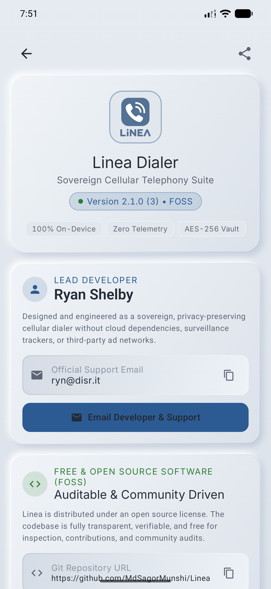
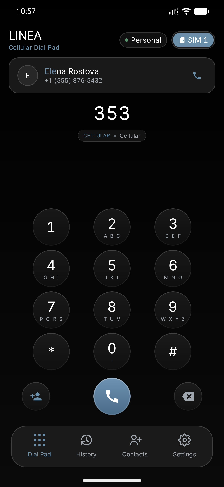
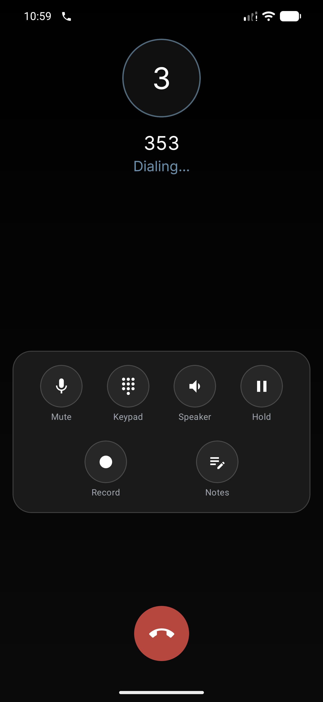
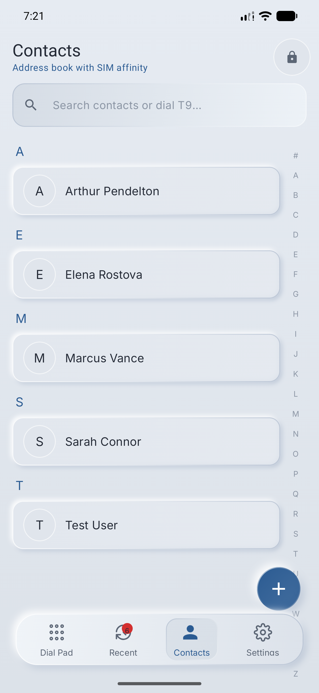
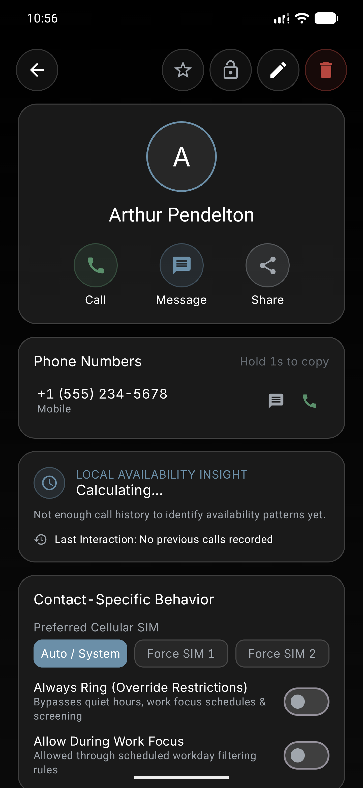
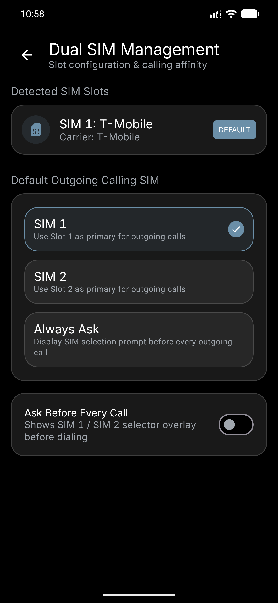
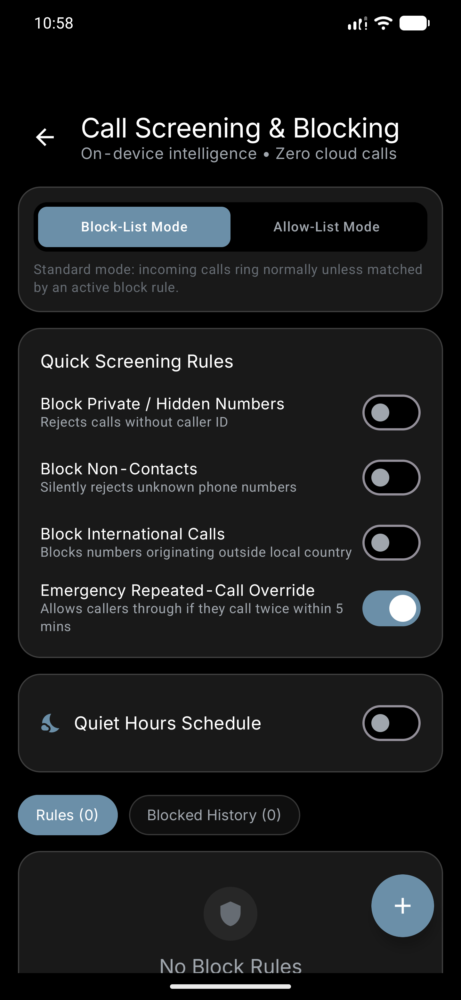
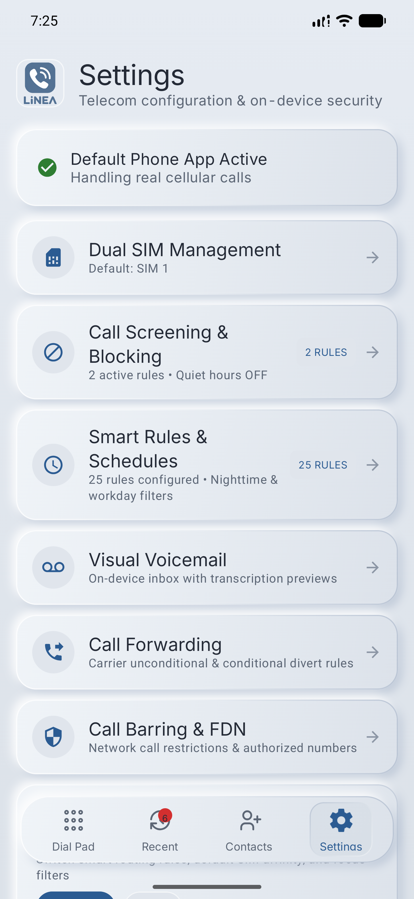

<p align="center">
  
</p>

<h1 align="center">LINEA</h1>

<p align="center">
  <strong>The Sovereign, Privacy-Preserving Cellular Dialer for Android 17 (API 37)</strong><br />
  <em>Tactile Neumorphic (Soft UI) Aesthetics • Native Telecom Framework • 100% On-Device • Zero Cloud Dependency</em>
</p>

<p align="center">
  <a href="https://developer.android.com/about/versions/17"></a>
  <a href="https://developer.android.com"></a>
  <a href="https://kotlinlang.org"></a>
  <a href="https://developer.android.com/jetpack/compose"></a>
  <a href="LICENSE"></a>
</p>

<p align="center">
  <a href="#about-linea">About</a> •
  <a href="#interface-showcase">Showcase</a> •
  <a href="#feature-suite">Features</a> •
  <a href="#design-system">Design System</a> •
  <a href="CHANGELOG.md">Changelog</a> •
  <a href="#getting-started">Installation</a> •
  <a href="BUILD.md">Build</a> •
  <a href="CONTRIBUTING.md">Contributing</a> •
  <a href="#developer--support">Support</a>
</p>

---

## About LINEA

**LINEA** (`com.ryanshelby.linea`) is a sovereign, high-performance cellular dialer engineered from scratch for **Android 17 (API 37)**. Built directly on Android's native Telecom framework (`InCallService`, `ConnectionService`, and `CallScreeningService`), LINEA acts as a full replacement for your stock phone app with genuine cellular calling, DTMF tone generation, multi-call conferencing, and carrier MMI management.

### The Zero-Cloud Privacy Manifesto
Modern stock dialers frequently upload call logs, contacts, and telemetry to proprietary cloud servers under the guise of caller identification or AI features. **LINEA rejects this paradigm completely:**
- **Zero Cloud AI**: All intelligence—including smart T9 indexing, availability pattern analysis, caller identification, and spam screening—runs 100% locally on your device.
- **Zero Telemetry**: No analytics SDKs, crash trackers, user telemetry, or third-party ad networks are bundled.
- **Hardware-Backed Encryption**: Sensitive contacts and private call notes are sealed behind an AES-256-GCM vault anchored in Android's hardware keystore.
- **Fully Free & Open Source**: Complete audibility and transparency under the permissive Apache 2.0 license.

---

## Interface Showcase

<p align="center">
  <em>A tactile Neumorphic (Soft UI) visual language featuring dual-shadow extruded surfaces, debossed wells, and monospaced tabular figures.</em>
</p>

| T9 Smart Dialpad | Active In-Call Screen | Contacts Directory | Contact Profile & Controls |
|:---:|:---:|:---:|:---:|
|  |  |  |  |
| *Instant T9 matching with inline contact resolution* | *Hardware audio routes, DTMF pad, and in-call notes* | *A-Z haptic scrubber rail with dual-sync persistence* | *SIM affinity, per-contact rules, and complete deletion* |

| Dual SIM Manager | Call Screening Engine | Settings & Preferences Hub | About & System Diagnostics |
|:---:|:---:|:---:|:---:|
|  |  |  |  |
| *Per-slot carrier display, dBm telemetry & default routing* | *Deterministic regex, prefix rules & emergency bypass* | *Full control over proximity, audio, and call retention* | *Auditable FOSS specs, developer info & OS environment* |

---

## Feature Suite

### 1. Native Cellular Calling Pipeline
- **Default Dialer Integration**: Seamlessly binds to Android telephony hardware as the system-designated default phone app.
- **Hardware Audio Switching**: Effortlessly toggle between Earpiece, Speakerphone, Bluetooth SCO headsets, and Wired Headsets with dynamic proximity sensor screen shutoff.
- **DTMF Tone Synthesizer**: Low-latency dual-tone multi-frequency audio generator with tactile haptic feedback for navigating phone trees and IVR systems.
- **Multi-Call & Conferencing**: Full support for call waiting, swapping between active lines, and merging simultaneous calls into 3-way conferences.

### 2. Instantaneous T9 Dialpad & Search
- **Sub-Millisecond Indexing**: Precomputed reverse prefix index maps numbers `2`–`9` across names, surnames, and organization tags.
- **Bipartite Search**: Matches both raw phone digit strings and contact names simultaneously without frame drops.
- **Clipboard Auto-Detection**: Instant detection of copied numbers from emails or browsers with one-tap dialing.

### 3. Contact Management & Deep Deletion
- **Dual-Write Architecture**: Changes made in LINEA instantly sync to Android's native `ContactsContract` and the local Room SQLite database.
- **Deep Contact Purge**: Complete contact deletion thoroughly cleans Room relational tables (`contacts`, `numbers`, `emails`, `group_members`) and purges raw and aggregate contacts from Android's system database.
- **SIM Affinity Rules**: Bind individual contacts to always dial through SIM 1 or SIM 2 automatically.
- **A-Z Haptic Scrubber**: Vertical alphabetical scrubber rail with micro-haptic ticks for rapid directory navigation.

### 4. Smart Call Screening & Quiet Hours
- **On-Device Screening**: Intercept spam, hidden numbers, and international calls before your device rings.
- **Emergency Repeated-Call Override**: Never miss an emergency: if any caller rings 3 times within 5 minutes, LINEA automatically bypasses Quiet Hours and silent filters.
- **Rule Engine**: Create custom filtering rules with exact matches, prefix wildcards (e.g. `+1800*`), and regular expressions.

### 5. Dual SIM Hardware Intelligence
- **Live Carrier Telemetry**: Displays carrier names, cellular technology (`5G`, `LTE`), and live signal strength in dBm.
- **Default Outgoing Slot**: Select SIM 1, SIM 2, or Always Ask before placing outgoing calls.
- **Cancelable Countdown Dialog**: Optional 3s / 5s / 10s auto-dial countdown timer allowing instant slot swapping before the call connects.

### 6. Visual Voicemail & Carrier Tools
- **On-Device Voicemail**: Visual playback slider, instant callback actions, and read/unread status management.
- **Carrier MMI Codes**: Built-in management for Call Forwarding (`*21*`, `*61*`) and Call Barring (`*33*`, `*35*`).

### 7. Private Vault & Security
- **PIN-Protected Safe**: Keep confidential contacts and sensitive call notes in a private vault hidden from public directory views.
- **Hardware-Backed AES-256-GCM**: Cryptographic master keys are stored securely inside Android's hardware `AndroidKeyStore`.

### 8. Full-Screen Cinematic Contact Posters
- **Cinematic Contact Backgrounds**: Renders full-screen blurred photo backdrops (`20.dp` Gaussian blur) with subtle breathing scale animations and vignette scrims.
- **Zero-Latency In-Memory LRU**: Uses LINEA's native 16MB bitmap cache for 0ms transition delays.
- **Architectural Fallback**: Monogram typographic watermarks for numbers without contact photos.

### 9. Call Recording Removal Notice
- **Removed Due to Android API Restrictions**: Call recording functionality and audio waving visualizer were completely removed due to Fucking Android API limitations and carrier-level audio silencing imposed by AOSP `AudioPolicyService`. LINEA focuses purely on zero-latency, private, and dependable cellular telephony.

### 10. Haptic Audio Dialpad Profiles
- **4 Selectable Acoustic & Tactile Profiles**:
  - *Tactile Neumorphic*: Crisp dual-micro clicks (`PRIMITIVE_CLICK`) with bright DTMF tones.
  - *Mechanical Relay*: Heavy tactile relay thump (`EFFECT_HEAVY_CLICK`) with classic relay acoustics.
  - *Stealth*: Subtle near-silent micro-vibrations with muted audio.
  - *Classic*: Standard Android dialpad feedback.

### 11. "Flip to Silence" & Proximity Wave Gestures
- **Zero-Touch Ringer Silencing**: Turn the device face-down or wave your hand over the top proximity sensor to immediately mute incoming ringtones.
- **Battery-Safe Sensor Lifecycle**: Sensors register strictly while the ringer is actively playing and immediately unregister when answered, rejected, or disconnected.
- **User Toggleable**: Defaulted to OFF; independently manageable under Settings &rarr; Motion & Call Gestures.

### 12. Quick Decline Neumorphic Action Sheet
- **Swipe-Up Rejection with SMS**: Quickly decline incoming calls with 1-tap pre-canned response chips or custom text replies directly sent via Android Telecom.

### 13. International Time Zone Preview & Country Detection
- **Dialpad Destination Intelligence**: Instant country code detection across 40+ nations, displaying flag, country name, live local destination time, and late-night warnings.

---

## Design System

LINEA adheres strictly to a **Tactile Neumorphic (Soft UI)** aesthetic, engineered for physical dialer tactility, visual clarity, low-light legibility, and OLED power efficiency:

| Design Token | Specification | Hex / Value | Visual Application |
|---|---|---|---|
| **Primary Background** | Dark Graphite Workspace | `#181B20` &rarr; `#1E2228` | Edge-to-edge dark canvas |
| **Neumorphic Raised Surface** | Extruded physical body | `#1E2228` with dual directional shadows | Cards, dialogs, dialpad keys, sheets |
| **Neumorphic Sunken Well** | Recessed debossed well | `#14171B` with inverted inner shadows | Search bars, input fields, active wells |
| **Top-Left Specular Light** | Directional specular highlight | `Color.White.copy(alpha = 0.09f)` | Raised rim lighting & upper surface edge |
| **Bottom-Right Ambient Shadow**| Ambient occlusion drop shadow | `Color.Black.copy(alpha = 0.65f)` | Natural 3D depth and elevation blur |
| **Primary Accent** | Titanium Blue | `#5C8DE6` | Primary action buttons, badges |
| **Success / Connect** | Sage Green | `#5A8F6B` | Call connect, incoming status |
| **Danger / Block** | Brick Red | `#B5473F` / `#8C3B35` | End call, delete contact, block rules |
| **Warning / Pinned** | Amber Gold | `#D4A359` | Emergency overrides, pinned contacts |
| **Numerics & Timers** | Tabular Figures | `fontFeatureSettings = "tnum"` | Dialpad digits, call duration timers |

---

## Getting Started

### Installation
1. Download the latest release APK from the [Releases](https://github.com/MdSagorMunshi/Linea/releases) page.
2. Install the APK to your device or emulator:
   ```bash
   adb install -r LiNEA-v1.0.0-release.apk
   ```

### Designate as System Default Dialer
To handle real cellular calls, incoming notifications, and call screening:
1. Open LINEA and navigate to **Settings** &rarr; **Permissions Architecture**.
2. Tap **Set as Default Dialer** and confirm the system prompt.
3. *Or set directly via ADB:*
   ```bash
   adb shell telecom set-default-dialer com.ryanshelby.linea
   ```

---

## Documentation

For developers, contributors, and technical deep dives:

- **[CHANGELOG.md](CHANGELOG.md)**: Detailed release notes, version history, and roadmap logs.
- **[BUILD.md](BUILD.md)**: Environment setup, compilation commands, and ADB telephony debugging cheat sheet.
- **[CONTRIBUTING.md](CONTRIBUTING.md)**: Code standards, pull request workflow, and commit conventions.
- **[SECURITY.md](SECURITY.md)**: Security policy, cryptographic architecture, and vulnerability disclosure SLA.
- **[ARCHITECTURE.md](ARCHITECTURE.md)**: Clean Architecture structure, Room schemas, and Telecom state machine.
- **[CODE_OF_CONDUCT.md](CODE_OF_CONDUCT.md)**: Contributor Covenant v2.1 open source standards.

---

## Developer & Support

- **Lead Developer**: Ryan Shelby
- **Official Support Email**: [ryn@disr.it](mailto:ryn@disr.it)
- **FOSS Git Repository**: [https://github.com/MdSagorMunshi/Linea.git](https://github.com/MdSagorMunshi/Linea.git)
- **Web Project Page**: [https://github.com/MdSagorMunshi/Linea](https://github.com/MdSagorMunshi/Linea)

---

## License

LINEA is released as Free and Open Source Software under the **[Apache License 2.0](LICENSE)**.

```
Copyright 2026 Ryan Shelby

Licensed under the Apache License, Version 2.0 (the "License");
you may not use this file except in compliance with the License.
You may obtain a copy of the License at

    http://www.apache.org/licenses/LICENSE-2.0

Unless required by applicable law or agreed to in writing, software
distributed under the License is distributed on an "AS IS" BASIS,
WITHOUT WARRANTIES OR CONDITIONS OF ANY KIND, either express or implied.
See the License for the specific language governing permissions and
limitations under the License.
```
